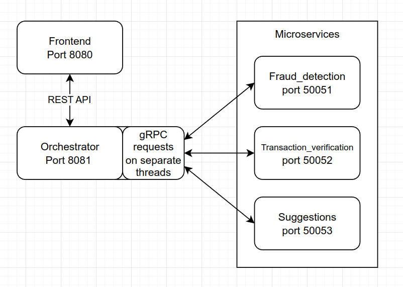
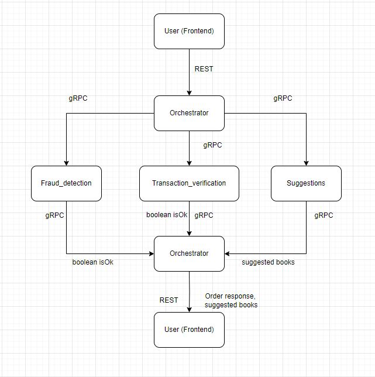
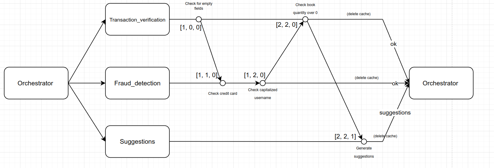
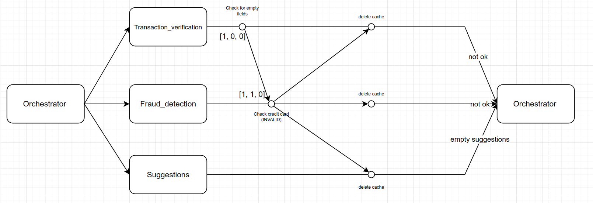
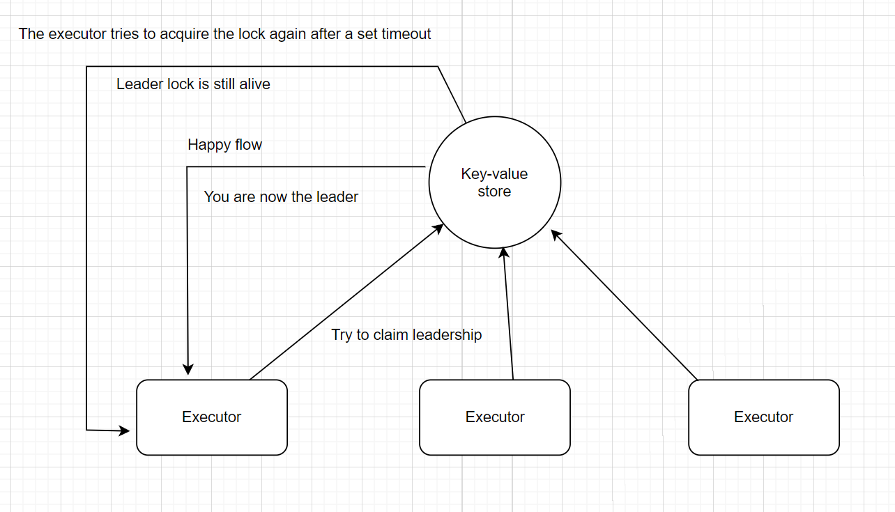
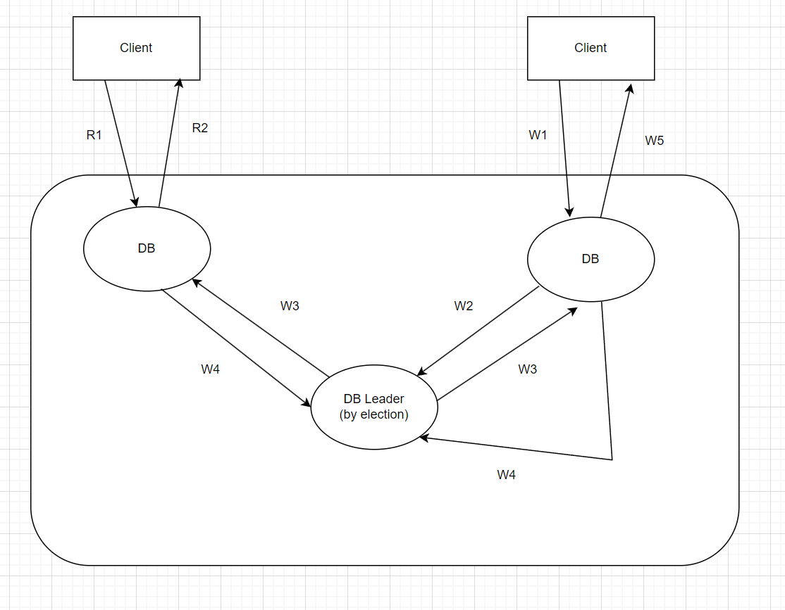
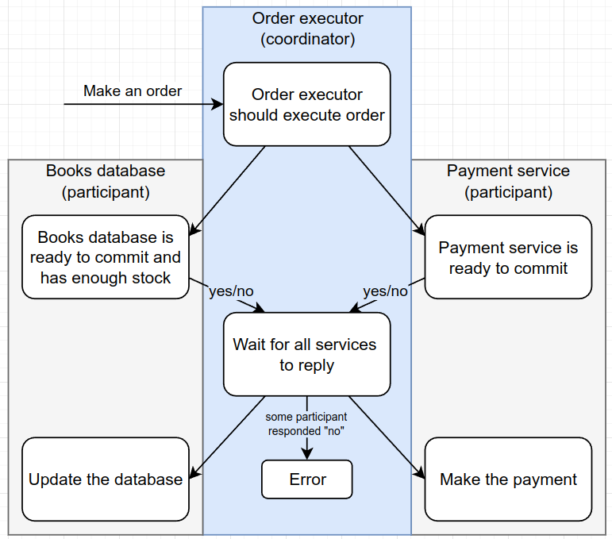
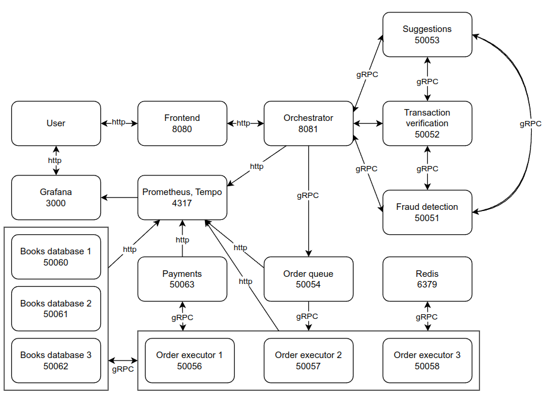
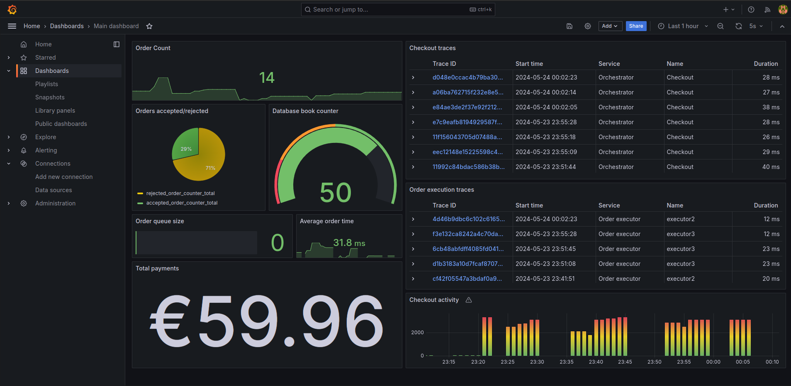

# Documentation

This folder should contain your documentation, explaining the structure and content of your project. It should also contain your diagrams, explaining the architecture. The recommended writing format is Markdown.

## Architecture diagram

## System diagram

## Vector clock diagram

### Successful order
All of the caches are cleared automatically, once a microservice returns its result to the Orchestrator.

### Failed order
If any check is failed, the service will notify all other services. All microservices will return a default answer, and the cache is cleared everywhere.

## Leader election

### Lock-based leader election
All the executors are trying to acquire the lock. The first one to acquire it becomes the leader. After the lock times out (current ttl=10) others can try to acquire it.

## Database Replication

The replication of database uses a Remote-write primary-based protocol where the primary server is being chosen by continuous leader elections

## Distributed Commitment Protocol

## Final architecture diagram

## Grafana dashboard

